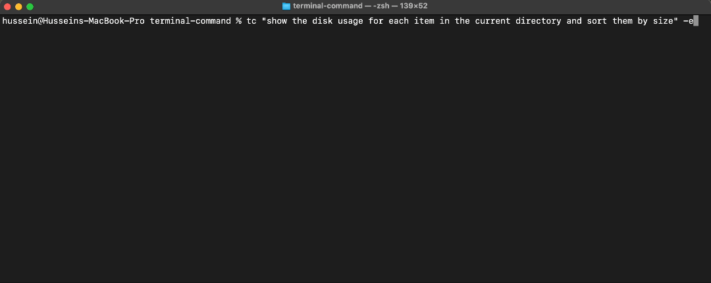

 

# terminal-command (tc)


> _The intuitive way to build complex shell commands, with safety in mind_

Instead of searching Stack Overflow or man pages for the right command syntax, `tc` uses AI to build shell commands from plain English

`tc` is a Python-based CLI tool for generating, and optionally executing, shell commands using an LLM. This project stemmed from challenges faced during work and research, where using multiple cli-based tools required frequent searching for the correct command syntax.

The project supports:

- **LLM Integration**: It queries the configured LLM provider (e.g., OpenAI or LiteLLM) to generate shell commands based on natural language input.
- **Configurable Endpoints and Models**: Endpoints are configurable via `config.yaml`. OpenAI-like endpoints are supported (ex. LiteLLM)
- **Suspicious Command Detection**: Utilizes both local substring checks and an LLM-based detection method to flag potentially dangerous commands. The list of suspicious substrings and the LLM detection prompt are configurable in `config.yaml`.
- **Optional Command Execution**: The tool can either print the generated command or execute it automatically using the `--execute` (or `-e`) flag (Suspicious commands are not automatically executed even with the -e flag).

## Demo

 

## Installation

**Requires:** Python 3.9+.

For **Linux/macOS**, run:
```bash
chmod +x ./_scripts/install.sh
./_scripts/install.sh
```

For **Windows**, run:
```powershell
powershell -ExecutionPolicy Bypass -File _scripts/install.ps1
```

Then, set the API key for the LLM provider in config.yaml (Automatically copied from _templates during installation). 

## Usage

To generate a command based on a natural language request:
```bash
tc "list running docker containers"
```
This prints the proposed command and explanation to the terminal.

To automatically execute the generated command, add the `-e` flag:
```bash
tc "list running docker containers" -e
```

## Further Configuration

The `config.yaml` file allows you to configure:
- **Default LLM Provider and Endpoints**: Configure the default provider (e.g., "openai" or "litellm"), API endpoints, and credentials.
- **Prompt Template**: A template to guide the LLM in producing structured JSON output.
- **Suspicious Command Detection**: 
  - A list of local suspicious substrings to quickly flag dangerous commands.
  - LLM-based detection settings, including the provider and a prompt template used to analyze command safety.

For detailed configuration options, see [CONFIG_DOC.md](_docs/CONFIG_DOC.md).

## Contributions

Contributions are welcome to improve this project

### How to Contribute
1. Fork the repository on GitHub.
2. Create a new branch for your feature or bug fix.
3. Make your changes and ensure they align with the project's goals and guidelines.
4. Submit a pull request with a description of your changes.

### Running Unit Tests
To ensure your changes don't break existing functionality, run the unit tests.

```bash
python ./run_tests.py
```

Make sure all tests pass before submitting your pull request.

### Contribution Guidelines
- **Efficiency**: Ensure your contributions keep the execution efficient. For example, avoid introducing changes that significantly increase the runtime of the `tc` command.
- **Safety**: Ensure that any changes or additions prioritize the safety of generated commands. Contributions should aim to prevent damage or unintended consequences by improving suspicious command detection or adding safeguards.
- **Code Quality**: Follow Python best practices and maintain clean, readable code.
- **Testing**: Add unit tests for any new features or changes.

## Disclaimer

This is an AI-powered tool. Use it at your own risk. The developer is not responsible for any consequences.

## License

This project is licensed under the MIT License - see the [LICENSE](LICENSE) file for details.
